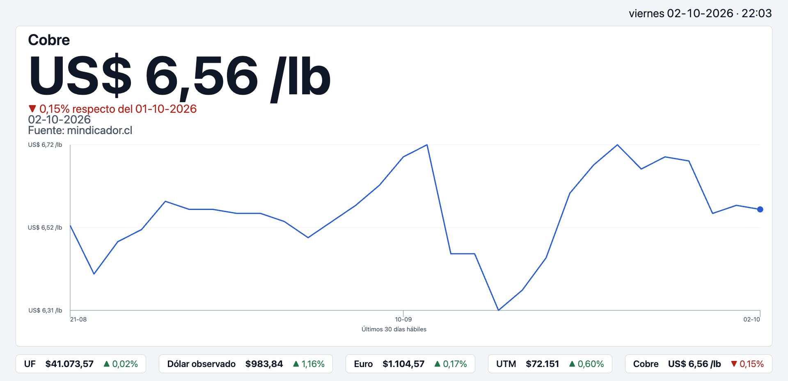
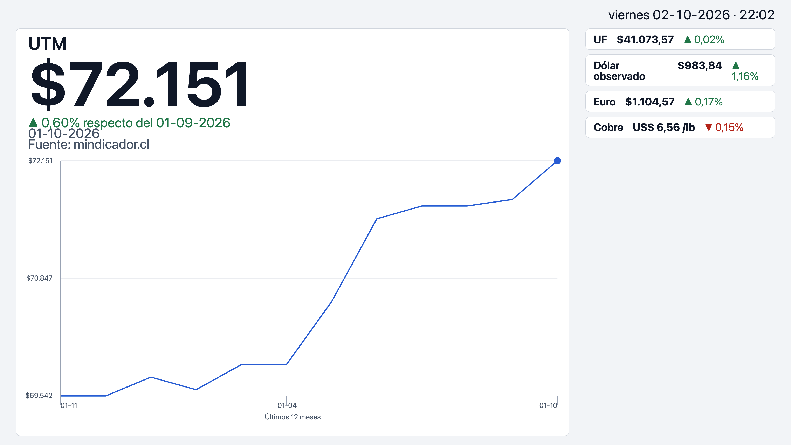

# Kiosco de indicadores mineros

Pantalla de recepción con indicadores financieros y mineros de Chile, pensada para funcionar sola todo el día.

[](https://github.com/rrobles-dev/kiosco-indicadores-mineros/actions/workflows/deploy.yml)

**Demo:** [vista de recepción](https://rrobles-dev.github.io/kiosco-indicadores-mineros/) · [vista de indicadores](https://rrobles-dev.github.io/kiosco-indicadores-mineros/?perfil=indicadores)

> **Estado:** v1.0.0. La especificación completa está en [`memory-bank/SPEC.md`](memory-bank/SPEC.md) y los cambios por versión en [`CHANGELOG.md`](CHANGELOG.md).

---

## El problema

El caso de uso que motivó el proyecto: una asociación gremial de proveedores de la minería recibe a socios y asistentes a eventos en su sede. Mientras esperan en recepción, o antes de que comience un evento, tienen frente a sí una pantalla que no comunica nada.

La asociación quiere que esa pantalla:

- **Informe** los indicadores que su audiencia consulta a diario: el precio del cobre, el dólar, la UF.
- **Dé visibilidad a sus socios** con un video de las empresas asociadas y sus logos.

El kiosco es configurable para cualquier organización: indicadores, perfiles, video y logos se definen en la configuración. Los nombres y logos incluidos son genéricos, de ejemplo.

La restricción que define el diseño: **nadie opera la pantalla.** Tiene que funcionar sola toda la jornada, tolerar caídas de internet o de las fuentes de datos y nunca mostrar un error o un dato antiguo como si fuera actual.

> Este proyecto reconstruye desde cero una solución real con datos públicos y contenido ficticio. No contiene código, datos ni material de la organización original.

---

## Cómo lo resuelve

| Necesidad | Solución |
|---|---|
| Que la pantalla no dependa de una sola fuente | Cada indicador tiene una fuente primaria y una de respaldo |
| Que nunca muestre un dato viejo como actual | Cada dato se valida contra la frecuencia real de su indicador. El dólar solo se fija en días hábiles; la UF, todos los días |
| Que una falla no deje la pantalla vacía | Se muestra el último valor conocido, rotulado con su fecha |
| Que una fuente lenta no congele la pantalla | La rotación de módulos es independiente de la carga de datos |
| Que cambiar de fuente no obligue a reescribir la interfaz | Un adaptador por fuente; los componentes no saben de dónde viene el dato |

---

## Capturas

**Perfil de recepción**



**Perfil de indicadores**



## Perfiles

El perfil se elige con el parámetro `?perfil=` en la URL. Sin parámetro, o con un valor desconocido, se usa `recepcion`.

| Perfil | URL | Qué muestra |
|---|---|---|
| `recepcion` (por defecto) | `/` o `/?perfil=recepcion` | Rotación en orden: cobre, dólar y euro, video, UF y UTM, y carrusel de logos. Una franja inferior muestra siempre los cinco indicadores |
| `indicadores` | `/?perfil=indicadores` | Un indicador destacado por escena, en orden aleatorio sin repeticiones, y los demás en una barra lateral |

Ambos perfiles muestran arriba la fecha y la hora de Chile.

## Indicadores de la v1

UF · dólar observado · euro · UTM · libra de cobre, cada uno con mini gráfico de su serie reciente, más un módulo de video y un carrusel de logos con contenido genérico de ejemplo.

## Limitaciones conocidas

- **Tipografía no validada a distancia:** los tamaños son relativos a la pantalla, pero falta comprobarlos en una pantalla de 60" vista a 4–5 m.
- **Estabilidad de 12 horas no medida:** el kiosco está pensado para funcionar toda la jornada sin recargar, pero aún no se ha medido una corrida completa.
- **Sin transiciones entre escenas:** el cambio de escena es instantáneo.
- **Diseño no adaptado a pantallas pequeñas:** está pensado para pantallas horizontales Full HD o mayores, no para celulares.
- **Datos diarios:** los valores se actualizan una vez al día según publica cada fuente; el cobre y las divisas en vivo llegan en la v2.

## Hoja de ruta

| Versión | Foco | Estado |
|---|---|---|
| **v1** | Kiosco solo frontend con datos diarios, fuente de respaldo y validación de vigencia | ✅ Completada (v1.0.0) |
| **v2** | Backend: fuentes oficiales con credenciales (Banco Central, CMF), cobre en vivo, ETL de datos de Cochilco, clima y sismos en regiones mineras | Planificada |
| **v3** | Base de datos y módulos históricos | Planificada |

---

## Stack

React · TypeScript · Vite · Vitest · React Testing Library

## Cómo correrlo

```bash
npm install
npm run dev
```

## Fuentes de datos

| Fuente | Uso |
|---|---|
| [mindicador.cl](https://mindicador.cl) | Fuente primaria de los indicadores diarios |
| [findic.cl](https://findic.cl) | Fuente de respaldo y series recientes |

Los valores de los indicadores provienen originalmente del Banco Central de Chile y otros organismos públicos, a través de estos servicios.

## Documentación

- [`memory-bank/SPEC.md`](memory-bank/SPEC.md): especificación de la v1, con contratos de datos verificados, reglas de vigencia, criterios de aceptación y registro de decisiones.
- [`AGENTS.md`](AGENTS.md): instrucciones para agentes de IA que trabajen en el repo.
- [`CHANGELOG.md`](CHANGELOG.md): cambios del producto por versión.

## Licencia

[MIT](LICENSE)
